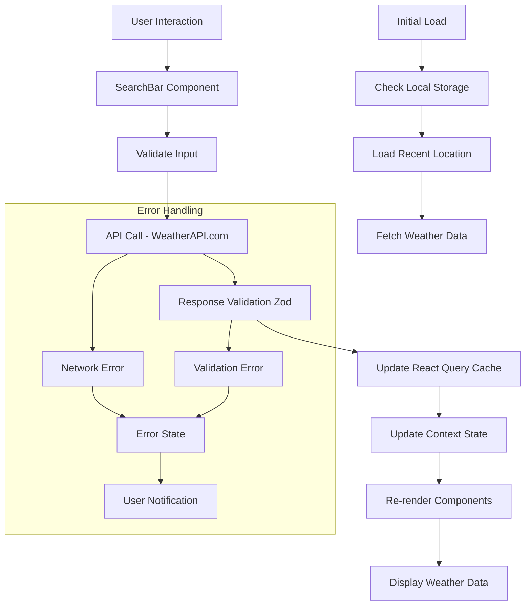

# React Weather App - Technical Architecture

## System Overview

The React Weather App is built on a modern, scalable architecture using Next.js 14+ with the App Router, TypeScript for type safety, and Tailwind CSS for styling. The application follows React best practices with a focus on performance, accessibility, and maintainability.

## Technology Stack

### Core Technologies
- **Framework**: Next.js 14+ with App Router
- **Language**: TypeScript 5+
- **Styling**: Tailwind CSS 3+
- **State Management**: React Context + React Query
- **HTTP Client**: Axios
- **Validation**: Zod
- **Testing**: Jest, React Testing Library, Cypress

### Development Tools
- **Package Manager**: npm or yarn
- **Linting**: ESLint with Next.js config
- **Formatting**: Prettier
- **Git Hooks**: Husky + lint-staged
- **Bundle Analysis**: @next/bundle-analyzer

## Component Architecture

### Component Hierarchy

```
App (Root)
├── Layout (AppShell)
│   ├── Header
│   ├── Main Content
│   │   ├── SearchBar
│   │   ├── WeatherDisplay (Conditional)
│   │   │   ├── CurrentWeather
│   │   │   │   ├── WeatherIcon
│   │   │   │   ├── TemperatureDisplay
│   │   │   │   ├── WeatherDetails
│   │   │   │   └── AdditionalInfo
│   │   │   └── Forecast
│   │   │       ├── ForecastDay
│   │   │       │   ├── DayHeader
│   │   │       │   ├── ForecastIcon
│   │   │       │   └── TemperatureRange
│   │   │       └── ForecastList
│   │   ├── LoadingState
│   │   ├── ErrorState
│   │   └── EmptyState
│   └── Footer
└── Providers
    ├── WeatherProvider (Context)
    ├── QueryProvider (React Query)
    └── ThemeProvider
```

### Component Responsibilities

#### Core Components
- **App**: Root component, sets up providers and routing
- **Layout**: Main application shell with header, main, footer
- **SearchBar**: Location input with autocomplete and validation
- **CurrentWeather**: Displays current weather conditions
- **Forecast**: 5-day forecast display component
- **WeatherIcon**: Dynamic weather icon rendering

#### State Components
- **WeatherProvider**: Global state management for weather data
- **QueryProvider**: React Query configuration and caching

#### Utility Components
- **LoadingState**: Loading spinners and skeletons
- **ErrorState**: Error message display and recovery
- **EmptyState**: Initial state and empty results

## State Management

### Global State (React Context)
```typescript
interface WeatherState {
  currentLocation: string;
  weatherData: WeatherData | null;
  forecastData: ForecastData | null;
  isLoading: boolean;
  error: string | null;
  searchHistory: string[];
}

// Context provides:
- current weather data
- forecast data
- loading states
- error states
- search history management
```

### Server State (React Query)
- **Queries**: Weather data fetching with caching
- **Mutations**: Search operations and data updates
- **Cache Configuration**: 10-minute stale time, background refetch

### Local State (useState)
- Form inputs and UI state
- Component-specific toggle states
- Animation and transition states

## Data Flow Architecture

### Data Flow Diagram



### API Integration Pattern

1. **Request Phase**:
   - User enters location in SearchBar
   - Input validated with Zod schema
   - API key and parameters constructed
   - Loading state activated

2. **Response Phase**:
   - API response validated with Zod schemas
   - Data transformed for UI consumption
   - Cache updated via React Query
   - Global state updated via Context
   - UI re-renders with new data

3. **Error Phase**:
   - Network errors caught and handled
   - Validation errors displayed to user
   - Fallback mechanisms activated
   - Retry mechanisms available

## Folder Structure

```
src/
├── app/                    # Next.js App Router
│   ├── globals.css        # Global styles
│   ├── layout.tsx         # Root layout
│   ├── page.tsx           # Home page
│   └── loading.tsx        # Loading component
├── components/            # Reusable components
│   ├── ui/               # Base UI components
│   ├── weather/          # Weather-specific components
│   └── layout/           # Layout components
├── contexts/             # React Context providers
│   └── WeatherContext.tsx
├── hooks/                # Custom React hooks
│   ├── useWeather.ts
│   └── useDebounce.ts
├── lib/                  # Utilities and configurations
│   ├── api/              # API clients and config
│   ├── utils/            # Helper functions
│   └── constants/        # App constants
├── types/                # TypeScript type definitions
│   └── weather.ts
├── styles/               # Additional styles
└── __tests__/            # Test files
```

## API Integration Architecture

### WeatherAPI.com Integration

**Endpoints**:
- `GET /current.json` - Current weather data
- `GET /forecast.json` - 5-day forecast
- `GET /search.json` - Location autocomplete

**Request Structure**:
```typescript
interface WeatherRequest {
  q: string;          // Location query
  days?: number;      // Forecast days (1-5)
  aqi?: 'yes' | 'no'; // Air quality data
  alerts?: 'yes' | 'no'; // Weather alerts
}
```

**Response Validation**:
```typescript
// Zod schemas for type-safe API responses
const currentWeatherSchema = z.object({
  location: z.object({/* ... */}),
  current: z.object({/* ... */}),
});

const forecastSchema = z.object({
  forecast: z.object({
    forecastday: z.array(forecastDaySchema)
  })
});
```

## Performance Optimization

### Bundle Optimization
- Next.js automatic code splitting
- Dynamic imports for heavy components
- Tree shaking enabled
- Bundle analysis in CI/CD

### API Optimization
- React Query caching strategies
- Request deduplication
- Response compression
- CDN caching headers

### Rendering Optimization
- React.memo for expensive components
- useCallback for event handlers
- Virtualization for large lists
- Efficient re-renders with proper dependency arrays

## Testing Architecture

### Test Pyramid Strategy
- **Unit Tests**: 70% - Components, utilities, hooks
- **Integration Tests**: 20% - Component interactions
- **E2E Tests**: 10% - Critical user flows

### Testing Tools
- **Jest**: Test runner and assertion library
- **React Testing Library**: Component testing
- **Cypress**: E2E testing
- **MSW**: API mocking

### Test Coverage Goals
- Utilities: 90%+
- Components: 80%+
- Hooks: 85%+
- Overall: 80%+

## Security Considerations

### API Security
- Environment variables for API keys
- Rate limiting implementation
- Input validation and sanitization
- CORS configuration

### Application Security
- Content Security Policy headers
- XSS protection
- HTTPS enforcement
- Dependency vulnerability scanning

## Monitoring and Analytics

### Performance Monitoring
- Core Web Vitals tracking
- Real User Monitoring (RUM)
- Error tracking with Sentry
- API performance metrics

### Business Metrics
- User engagement tracking
- Feature usage analytics
- Conversion funnels
- Error rate monitoring

## Deployment Architecture

### Build Process
1. TypeScript compilation
2. Next.js build optimization
3. Static generation where possible
4. Bundle analysis
5. Security scanning

### Deployment Pipeline
- **Development**: Vercel preview deployments
- **Staging**: Full test environment
- **Production**: Zero-downtime deployments

### Environment Configuration
- Environment-specific variables
- Feature flags implementation
- A/B testing setup
- Rollback strategies

This architecture provides a solid foundation for a scalable, maintainable weather application that can evolve with changing requirements while maintaining high performance and excellent user experience.